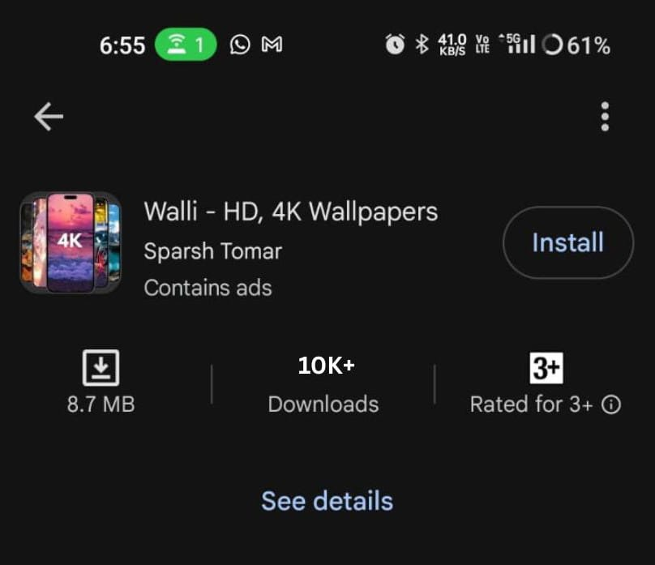
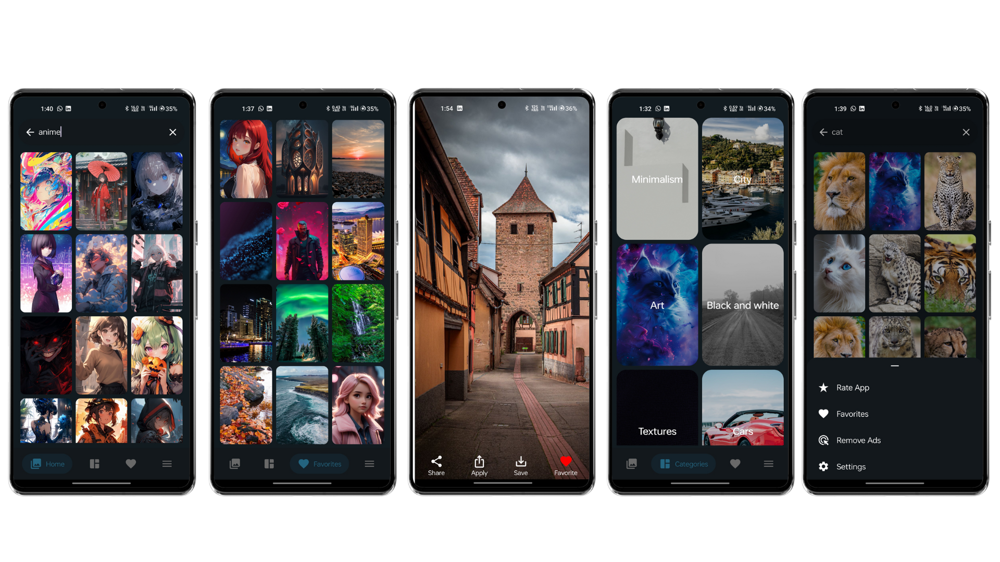

# Walli 4K Wallpapers

Walli 4K Wallpapers is an Android application that offers users a stunning collection of high-resolution 4K wallpapers. Designed with performance in mind, it allows smooth browsing, search by tags, and efficient image loading.

## 🚀 Features

- 🌄 Huge collection of 4K wallpapers
- 🔍 Tag-based search functionality
- 📥 Save wallpapers directly to your device
- ❤️ Add to favorites
- 🌓 Dark mode support
- ⚡ Fast and lightweight

## 🛠️ Built With

- Kotlin
- Jetpack Components (ViewModel, LiveData, Room)
- Retrofit / Glide / Firebase Firestore
- MVVM architecture

## 📊 Play Store Performance

This app was previously published on the Google Play Store and received an impressive number of downloads before the developer account faced some issues. See the screenshot below as proof:

> 📈 **Total Downloads:** Over 10K+ downloads on the Play Store

## 📱 Screenshots

## 📦 Installation

1. Clone the repository
2. Open in Android Studio
3. Build and run on an Android device or emulator

## 🔐 Permissions Required

- Read External Storage
- Write External Storage (if targeting Android 10 or below)
- Manage All Files access (for Android 11+)
